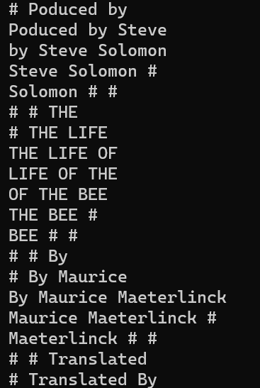

## Command Line Tools for Linguists
The course is a basic intoroduction to the commandline. Every course week consists of reading materials, tutorials with exercises, and quizzes.  
Many tasks practiced on the course are linguistically motivated. The course also has a final project, where the students use the skills learned on the course.  
 
### Week 1
Content:
* Introduction and installation of command line enviroments
* Basic commands

I learned to use very basic commands and the text editor nano.

Commands:
```
wget [options] [url]
```
Fetches a file from the internet
```
mv [options] [source_file_name] [destination_file_name]
```
Moves a file or a directory to another location, or  
renames a file or directory

### Week 2
Content:
* How to manage directories
* Permissions in UNIX
* Working on a remote server

I learned how manage file permissions that protect the user's privacy, how processes work and how to connect to the remote server puhti

Commands:
```
ssh puhti.csc.fi
```
Connects to the remote server puhti

### Week 3
Content:
* Using text processing tools
* Character encodings
* Structured text files

I learned how character encodings work and why converting between different encodings (ASCII, utf-8, Latin-1) is important. Also learned regural expressions for searching patterns. 

Commands:
```
tr [options] 'SET1' 'SET2'
```
Replaces characters, can be used to delete characters with option -d
```
egrep [options] 'PATTERN' file
```
Finds patterns in text files using regular expressions

### Week 4

Content:
* Continuation on using text processing tools
* Piping commands

I learned to pipe commands to form more complex operations easily, especially for text processing tasks like making frequency lists.

Commands:
```
sed [options] [SCRIPT] [INPUTFILE]
```
A versatile tool for editing files. Is used for finding and replacing strings, insertion, deletion, etc.


### Week 5
Content:
* Creating scripts 
* Configuration files

I learned to set up a configuration file for changing enviromental variables and using them I individualized my prompt.  
I also made scripts to make complex text processing task easier and faster. 

Commands:
```
cat $1 |
dos2unix |
tr -s "[:space:]" "\n" |
tr -d "[:punct:]" |
sort |
uniq -c |
sort -nr > $2
```
Script for creating frequency lists.  
Reads text file from standard input and through several text processing commands creates a numerically reversed list of word frequencies and directs the output to a file.

### Week 6
Content:

What I learned:


Commands:
```

```

```

```

### Week 7
Content:

What I learned:


Commands:
```

```

```

```
