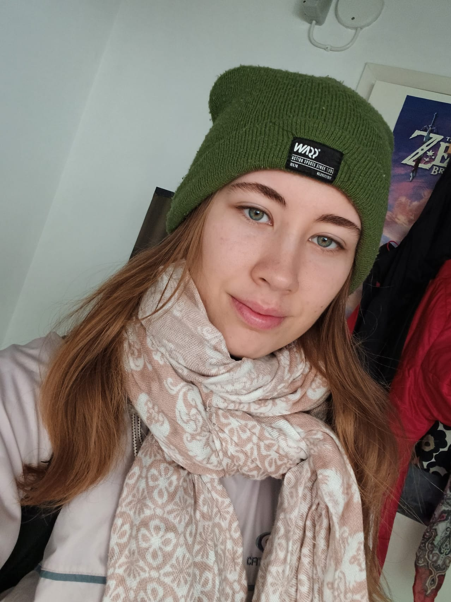

## Introduction

 I'm a third year linguistics student at the University of Helsinki. The languages I speak are Finnish, Swedish, English, Spanish and Basque.  
Some of the hobbies I have are tap dance, gym, playing video games, cosplay, and making crafts. And of course I always like to learn new languages.

## Find me on

[LinkedIn](https://www.linkedin.com/in/emma-lunden/), [GitHub](https://github.com/lundenemma)

## CV

[My CV](\assets\documents\lundenemma_cv.pdf)

## Contact

My email address is of the form first_name.last_name@helsinki.fi 

## Some Courses I've Taken

[Advanced Course in Phonology](https://studies.helsinki.fi/courses/course-unit/otm-848f303a-5aa5-4a68-aef9-9d215c568577/KIK-LG201), fall 2022

[Advanced Course in Morphology and Syntax](https://studies.helsinki.fi/courses/course-unit/otm-9bc53b4a-d53b-45c7-ad68-a71032b734e9/KIK-LG202), fall 2022

[Mathematics for Linguists](https://studies.helsinki.fi/courses/course-unit/otm-78ac8520-fe65-4b8a-9017-a76711c08adf/KIK-LG209), spring 2023

[Statistics for Linguists](https://studies.helsinki.fi/courses/course-unit/otm-c1c8d588-1860-43e0-8105-ce0fcde9c3a6/KIK-LG207), spring 2023

[Command Line Tools for Linguists](https://studies.helsinki.fi/courses/course-unit/otm-92ee484e-456b-409f-a397-d9d2b6e40a2f/KIK-LG221), fall 2023

## Projects

[Gutenberg books](https://github.com/lundenemma/cmdline-course)

A small project done in the Command Line Tools for Linguistics course.  
The objective was to use scripts and the make command to process and create a collection of text files. The texts used in the project are books obtained from the [Project Gutenberg](https://www.gutenberg.org/). 

## Misc. 

Interesting language sites:
 * [Ordbok över Finlands svenska folkmål](https://kaino.kotus.fi/fo/), a dictionary of words used in Finnish-Swedish dialects
 * [Diccionario de la lengua española](https://dle.rae.es/), a dictionary of the Spanish language maintained by the Royal Spanish Academy, which is the most important language institution in Spain
 * [Euskalkiak](http://euskalkiak.eus/en/), a site that provides information about the Basque dialects
